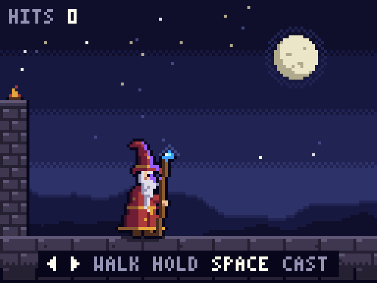

# Moonlit Spellcaster

A tiny playable pixel art wizard. Walk a moonlit rampart, hold to charge a bolt, and knock down targets.

**[Play it in your browser](https://clubhouse1661.github.io/moonlit-spellcaster/)**

## Controls

| Action | Keyboard | Touch |
| --- | --- | --- |
| Walk | ← → or A D | left and right buttons |
| Charge | hold Space | hold the gem button |
| Cast | release Space | release the gem button |

A quick tap fires a weak bolt. Holding for up to 1.4 seconds builds a bigger one, and a full charge punches through every target in its path. You can turn to aim while charging, but you can't walk.

## How it's made

Built with Claude from two prompts: the original animated-wizard prompt by Majid Manzarpour, and a follow-up that turns it into a game. Both are in [PROMPT.md](PROMPT.md).

One HTML file, vanilla JavaScript and Canvas 2D, no libraries or assets.

- Everything is drawn into a 128×96 buffer of palette indices (26 colors), then scaled up by the largest whole number that fits your screen.
- The wizard is built procedurally from pose parameters each frame and mirrored for facing. The pose eases smoothly at 60 Hz but is sampled at 10 fps, so it moves like hand-drawn sprite frames.
- The walk cycle is 8 frames (contact, down, passing, up for each foot). Planted feet and the walking stick travel back exactly as far as the body moves forward, so nothing slides.
- A fixed 60 Hz simulation runs on `requestAnimationFrame`, and particles live in a preallocated pool, so the game loop allocates nothing.
